# Diagrama ER definitivo — MySQL

**Estado:** vigente después de la extensión de catálogo del 25 de agosto de 2026.

```mermaid
erDiagram
    roles {
        INT id PK
        VARCHAR nombre UK
        VARCHAR descripcion
    }
    usuarios {
        INT id PK
        VARCHAR email UK
        VARCHAR password_hash
        VARCHAR nombre
        VARCHAR apellido
        VARCHAR telefono
        ENUM estado
        BOOLEAN email_verificado
        DATETIME fecha_alta
        DATETIME fecha_actualizacion
    }
    usuario_rol {
        INT usuario_id PK,FK
        INT rol_id PK,FK
        DATETIME asignado_en
    }
    direcciones {
        INT id PK
        INT usuario_id FK
        ENUM tipo
        VARCHAR pais
        VARCHAR departamento
        VARCHAR municipio
        VARCHAR linea1
        VARCHAR linea2
        VARCHAR codigo_postal
        BOOLEAN es_predeterminada
        BOOLEAN activa
    }
    vendedores {
        INT id PK
        INT usuario_id FK,UK
        VARCHAR nombre_comercial
        VARCHAR nit UK
        TEXT descripcion
        VARCHAR logo_url
        ENUM estado_verificacion
        DATETIME fecha_registro
    }
    categorias {
        INT id PK
        INT categoria_padre_id FK
        VARCHAR nombre
        VARCHAR slug UK
        VARCHAR sku_prefix UK
        TEXT descripcion
        VARCHAR imagen_url
        BOOLEAN activa
        SMALLINT orden
    }
    producto_referencias {
        INT id PK
        CHAR producto_ref UK
        INT categoria_id FK
        DATETIME fecha_creacion
    }
    producto_referencia_categorias {
        INT id PK
        INT producto_referencia_id FK
        INT categoria_id FK
        BOOLEAN es_principal
    }
    producto_imagenes {
        INT id PK
        INT producto_referencia_id FK
        INT subida_por FK
        LONGBLOB datos
        VARCHAR mime_type
        SMALLINT orden
        DATETIME fecha_creacion
    }
    ofertas {
        INT id PK
        CHAR producto_ref FK
        INT vendedor_id FK
        VARCHAR sku
        DECIMAL precio_actual
        CHAR moneda
        ENUM estado
        INT version
        DATETIME fecha_creacion
        DATETIME fecha_actualizacion
    }
    oferta_precios_historial {
        BIGINT id PK
        INT oferta_id FK
        DECIMAL precio
        CHAR moneda
        DATETIME vigente_desde
        DATETIME vigente_hasta
        INT cambiado_por FK
        VARCHAR motivo
        DATETIME fecha_registro
    }
    inventario {
        INT id PK
        INT oferta_id FK
        INT cantidad_disponible
        INT cantidad_reservada
        INT punto_reorden
        VARCHAR bodega
        DATETIME fecha_actualizacion
    }
    movimientos_inventario {
        BIGINT id PK
        INT inventario_id FK
        ENUM tipo
        INT cantidad
        VARCHAR motivo
        INT pedido_id FK
        INT usuario_id FK
        DATETIME fecha
    }
    pedidos {
        INT id PK
        INT usuario_id FK
        INT direccion_id FK
        ENUM estado
        DECIMAL subtotal
        DECIMAL impuestos
        DECIMAL total
        TEXT notas
        DATETIME fecha_creacion
        DATETIME fecha_actualizacion
    }
    pedido_vendedores {
        INT id PK
        INT pedido_id FK
        INT vendedor_id FK
        ENUM estado
        DECIMAL subtotal
        DECIMAL costo_envio
        DATETIME fecha_creacion
        DATETIME fecha_actualizacion
    }
    pedido_direcciones {
        INT pedido_id PK,FK
        VARCHAR receptor_nombre
        VARCHAR receptor_telefono
        VARCHAR pais
        VARCHAR departamento
        VARCHAR municipio
        VARCHAR linea1
        VARCHAR linea2
        VARCHAR codigo_postal
    }
    pedido_lineas {
        BIGINT id PK
        INT pedido_id FK
        INT pedido_vendedor_id FK
        INT oferta_id FK
        CHAR producto_ref
        VARCHAR sku_snapshot
        VARCHAR producto_nombre
        VARCHAR vendedor_nombre_snapshot
        DECIMAL precio_unitario
        SMALLINT cantidad
        DECIMAL subtotal_linea
    }
    metodos_pago {
        INT id PK
        VARCHAR nombre UK
        BOOLEAN activo
    }
    pagos {
        INT id PK
        INT pedido_id FK
        INT metodo_pago_id FK
        DECIMAL monto
        ENUM estado
        VARCHAR referencia_transaccion
        DATETIME fecha
    }
    carritos {
        INT id PK
        INT usuario_id FK
        ENUM estado
        DATETIME fecha_creacion
        DATETIME fecha_actualizacion
    }
    carrito_items {
        BIGINT id PK
        INT carrito_id FK
        INT oferta_id FK
        CHAR producto_ref
        SMALLINT cantidad
        DECIMAL precio_al_agregar
        DATETIME fecha_agregado
    }
    resenas {
        BIGINT id PK
        INT usuario_id FK
        INT producto_referencia_id FK
        SMALLINT calificacion
        TEXT comentario
        BOOLEAN aprobada
        DATETIME fecha
    }
    notificaciones {
        BIGINT id PK
        INT usuario_id FK
        VARCHAR tipo
        VARCHAR titulo
        TEXT mensaje
        BOOLEAN leida
        INT pedido_id FK
        DATETIME fecha_creacion
    }
    outbox_eventos {
        CHAR id PK
        VARCHAR tipo_evento
        VARCHAR agregado_tipo
        VARCHAR agregado_id
        CHAR producto_ref
        JSON payload
        ENUM estado
        SMALLINT intentos
        TEXT ultimo_error
        DATETIME creado_en
        DATETIME procesado_en
    }
    solicitudes_catalogo {
        BIGINT id PK
        INT vendedor_id FK
        ENUM tipo
        ENUM estado
        CHAR producto_ref_solicitado FK
        VARCHAR nombre
        VARCHAR sku_propuesto
        DECIMAL precio_propuesto
        INT stock_propuesto
        INT revisada_por FK
        CHAR producto_ref_resultado FK
        INT oferta_id_resultado FK
        DATETIME fecha_creacion
        DATETIME fecha_revision
    }
    solicitud_catalogo_categorias {
        BIGINT id PK
        BIGINT solicitud_id FK
        INT categoria_id FK
        SMALLINT orden
    }
    solicitud_catalogo_imagenes {
        BIGINT id PK
        BIGINT solicitud_id FK
        INT producto_imagen_id FK
        SMALLINT orden
    }

    usuarios ||--o{ usuario_rol : recibe
    roles ||--o{ usuario_rol : asigna
    usuarios ||--o{ direcciones : posee
    usuarios ||--o| vendedores : administra
    categorias ||--o{ categorias : contiene
    categorias ||--o{ producto_referencias : clasifica
    categorias ||--o{ producto_referencia_categorias : agrupa
    producto_referencias ||--o{ producto_referencia_categorias : categoriza
    producto_referencias ||--o{ producto_imagenes : almacena
    usuarios |o--o{ producto_imagenes : carga
    producto_referencias ||--o{ ofertas : habilita
    vendedores ||--o{ ofertas : publica
    ofertas ||--o{ oferta_precios_historial : historiza
    usuarios |o--o{ oferta_precios_historial : cambia
    ofertas ||--o{ inventario : abastece
    inventario ||--o{ movimientos_inventario : registra
    usuarios |o--o{ movimientos_inventario : ejecuta
    usuarios ||--o{ pedidos : realiza
    direcciones ||--o{ pedidos : selecciona
    pedidos ||--o{ pedido_vendedores : divide
    vendedores ||--o{ pedido_vendedores : atiende
    pedidos ||--|| pedido_direcciones : congela
    pedidos ||--o{ pedido_lineas : contiene
    pedido_vendedores ||--o{ pedido_lineas : agrupa
    ofertas ||--o{ pedido_lineas : vende
    pedidos |o--o{ movimientos_inventario : origina
    pedidos ||--o{ pagos : recibe
    metodos_pago ||--o{ pagos : utiliza
    usuarios ||--o{ carritos : posee
    carritos ||--o{ carrito_items : contiene
    ofertas ||--o{ carrito_items : agrega
    usuarios ||--o{ resenas : escribe
    producto_referencias ||--o{ resenas : recibe
    usuarios ||--o{ notificaciones : recibe
    pedidos |o--o{ notificaciones : contextualiza
    vendedores ||--o{ solicitudes_catalogo : propone
    usuarios |o--o{ solicitudes_catalogo : revisa
    producto_referencias |o--o{ solicitudes_catalogo : solicita_o_resulta
    ofertas |o--o{ solicitudes_catalogo : resulta
    solicitudes_catalogo ||--o{ solicitud_catalogo_categorias : clasifica
    categorias ||--o{ solicitud_catalogo_categorias : propone
    solicitudes_catalogo ||--o{ solicitud_catalogo_imagenes : adjunta
    producto_imagenes ||--o| solicitud_catalogo_imagenes : vincula
```

## Referencias lógicas hacia MongoDB

`producto_referencias.producto_ref` contiene el ObjectId hexadecimal del
documento en MongoDB `productos`; esa es la única referencia intermotor de la
cadena y no puede expresarse como FK. Dentro de MySQL,
`ofertas.producto_ref` sí referencia `producto_referencias.producto_ref`.
`pedido_lineas`, `carrito_items` y `outbox_eventos` conservan copias del mismo
identificador con la semántica histórica o de integración descrita en el
modelo.

`producto_referencias` no duplica el catálogo: registra una identidad estable
y su categoría SQL. MongoDB conserva el nombre y slug de categoría como
snapshot documental para lectura. La oferta es la identidad comprable y el
inventario pertenece a la oferta, no al documento.

## Restricciones principales

- `ofertas`: una oferta por `(vendedor_id, producto_ref)` y SKU único por
  vendedor.
- `inventario`: una fila por `(oferta_id, bodega)`.
- `pedido_vendedores`: una parte por `(pedido_id, vendedor_id)`.
- `carrito_items`: una oferta por carrito.
- `resenas`: una reseña por `(usuario_id, producto_referencia_id)`.
- `oferta_precios_historial`: una sola vigencia abierta por oferta.
- `producto_referencia_categorias`: una relación única por producto/categoría
  y exactamente una categoría principal, verificada por instalación y pruebas.
- `solicitudes_catalogo`: solo las solicitudes pendientes pueden revisarse;
  las categorías y las posiciones de imagen no se duplican dentro de una
  solicitud.

El diagrama representa el esquema posterior a
`database/mysql/13_catalog_requests.sql`, no el DDL transicional previo.
