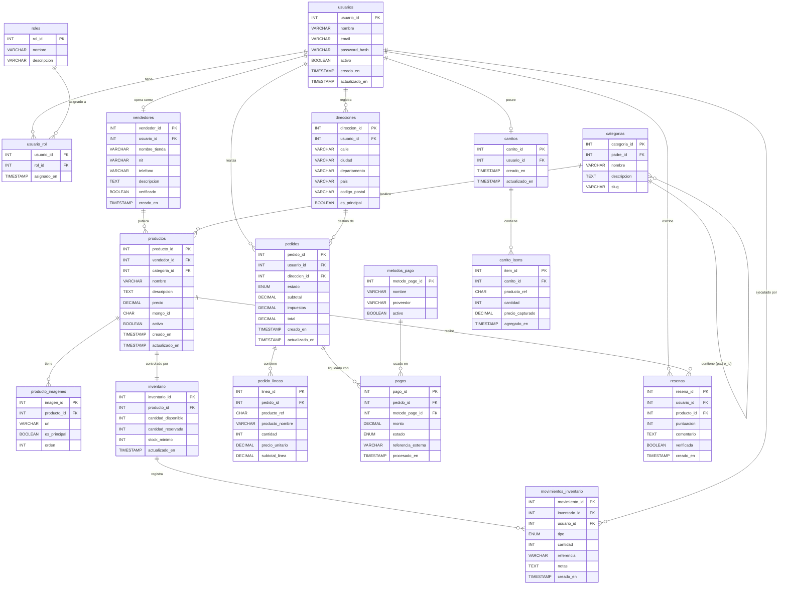

# Diagrama Entidad-Relación — TiendaYa

El siguiente diagrama cubre todas las tablas del modelo relacional en MySQL 8. Las cardinalidades usan la notación estándar de Mermaid (`||`, `|{`, `}|`, etc.).

## Notas sobre el diagrama

**Relación `categorias` auto-referenciada:** La columna `padre_id` apunta a la misma tabla `categorias`. Esto permite modelar la jerarquía de dos niveles del catálogo — por ejemplo, `electrónica` es padre de `computadoras`, `celulares` y `audio`. Mermaid lo representa como un loop sobre la misma entidad.

**`producto_ref` en `pedido_lineas` y `carrito_items`:** Esta columna de tipo `CHAR(24)` guarda el ObjectId de MongoDB del producto. No existe FK formal porque MySQL no puede referenciar MongoDB, pero la relación lógica es clara. La documentación del cruce entre bases de datos está en `07-referencia-sql-mongo.md`.

**`mongo_id` en `productos`:** La tabla `productos` de MySQL guarda también el ObjectId de su contraparte en la colección `catalogo` de MongoDB. Esto permite joins a nivel de aplicación entre el registro MySQL (precio, stock, vendedor_id) y el documento MongoDB (atributos variables, imágenes, historial de eventos).

**Cardinalidades destacadas:**
- Un usuario tiene exactamente un carrito (`||--o|`), pero puede tener cero o muchos pedidos (`||--o{`).
- Un producto tiene exactamente un registro de inventario (`||--||`), modelado como 1:1 estricto.
- Un vendedor puede tener cero productos al inicio (`||--o{`), lo que permite onboarding sin publicar de inmediato.
