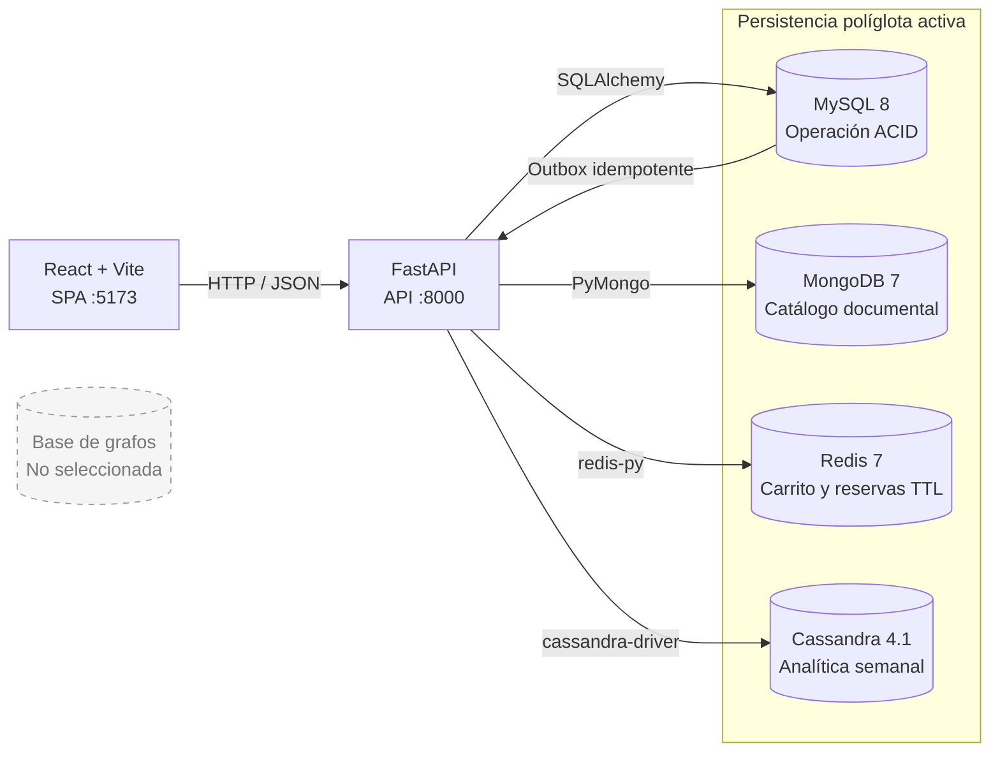

# Diagrama de Arquitectura — TiendaYa

## Arquitectura actual (Entrega 2)

## Responsabilidad por motor

| Componente | Autoridad y propósito |
|---|---|
| MySQL | Usuarios, vendedores, ofertas, precios, inventario, pedidos, pagos, reseñas, solicitudes y outbox |
| MongoDB | Productos, variantes, atributos e historial documental; no decide precio ni stock |
| Redis | Carritos activos y reservas de venta flash con expiración automática |
| Cassandra | Proyección analítica de ventas pagadas por producto, oferta, vendedor y semana |

FastAPI orquesta los cuatro motores. El checkout solo depende de MySQL para
confirmar la compra: vuelve a validar y bloquear precio, estado e inventario.
Después publica un evento en el outbox dentro de la misma transacción. El
worker actualiza MongoDB o Cassandra según el tipo de evento y puede reintentar
sin duplicar resultados.

## Decisión columnar

Cassandra se eligió frente a una base de grafos porque la consulta de esta
entrega compara demanda entre intervalos semanales. Las tablas están
desnormalizadas por consulta para evitar JOIN y agregaciones costosas al abrir
los paneles. La justificación completa está en
[`26-decision-grafos-columnar.md`](26-decision-grafos-columnar.md) y el modelo
físico en [`27-analitica-cassandra.md`](27-analitica-cassandra.md).

Una base de grafos permanece fuera de la arquitectura actual. Sería una opción
posterior para recomendaciones y recorridos de afinidad, no para la analítica
temporal ya implementada.
