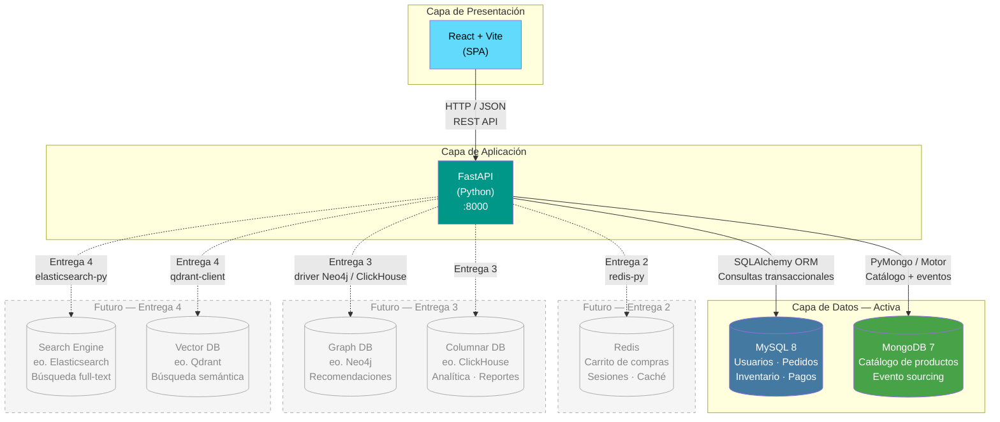

# Diagrama de Arquitectura — TiendaYa

## Arquitectura actual (Entrega 1)

## Descripción de componentes activos

### React + Vite (Frontend)
La SPA consume la API REST de FastAPI directamente. Vite sirve los assets en desarrollo con HMR y genera el bundle de producción. No existe backend-for-frontend separado en esta entrega — React habla directo con FastAPI.

Las rutas principales de la SPA son: catálogo (listado y ficha de producto), carrito, checkout, historial de órdenes y panel de vendedor. Cada ruta hace sus propias llamadas a los endpoints correspondientes de la API.

### FastAPI (Backend)
FastAPI actúa como orquestador entre las dos bases de datos activas. Sus responsabilidades son:

- Autenticación y autorización con JWT.
- Enrutamiento de queries: las consultas de catálogo y atributos van a MongoDB; las transaccionales (crear orden, verificar stock, procesar pago) van a MySQL.
- Joins a nivel de aplicación: cuando necesito mostrar una orden con el nombre del producto, FastAPI resuelve el `producto_ref` de `pedido_lineas` contra MongoDB para obtener los datos del catálogo.
- Validación de integridad cruzada antes de confirmar una compra.

### MySQL 8
Almacena todos los datos donde la consistencia transaccional importa: usuarios, roles, pedidos, pagos, inventario y movimientos de stock. La elección de MySQL aquí es deliberada — necesito transacciones ACID para el proceso de checkout (descontar inventario + crear pedido + registrar pago en una sola transacción atómica).

### MongoDB 7
Almacena el catálogo de productos con sus atributos heterogéneos y la colección `producto_eventos` para el historial de cambios. No participa en transacciones de checkout; su rol es lectura intensiva del catálogo y escritura append-only de eventos.

## Componentes planeados

| Componente | Entrega | Propósito |
|---|---|---|
| Redis | Entrega 2 | Sesiones de usuario, caché de catálogo frecuente, carrito efímero |
| Neo4j (o similar) | Entrega 3 | Motor de recomendaciones "también te puede interesar" basado en grafos de compras |
| ClickHouse (o similar) | Entrega 3 | Analítica de ventas por categoría, dashboards de vendedor |
| Elasticsearch | Entrega 4 | Búsqueda full-text con filtros facetados por atributo |
| Qdrant (o similar) | Entrega 4 | Búsqueda semántica — "encuentra algo parecido a esta descripción" |
