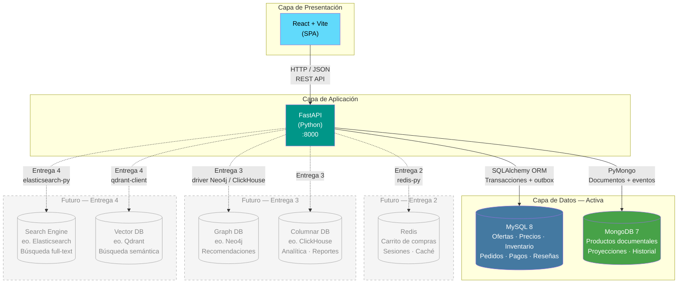

# Diagrama de Arquitectura — TiendaYa

## Arquitectura actual (Entrega 1)

## Descripción de componentes activos

### React + Vite (Frontend)
La SPA consume la API REST de FastAPI directamente. Vite sirve los assets en desarrollo con HMR y genera el bundle de producción. No existe backend-for-frontend separado en esta entrega — React habla directo con FastAPI.

Las rutas principales de la SPA son: catálogo (listado y ficha de producto), carrito, checkout, historial de órdenes y panel de vendedor. Cada ruta hace sus propias llamadas a los endpoints correspondientes de la API.

### FastAPI (Backend)
FastAPI actúa como orquestador entre las dos bases de datos activas. Sus responsabilidades son:

- Autenticación y autorización con JWT.
- Lectura combinada del catálogo: MongoDB aporta contenido documental y MySQL
  aporta ofertas, precio, vendedor e inventario mediante una consulta por lote.
- Checkout transaccional: bloquea ofertas e inventario con `SELECT FOR UPDATE`,
  crea pedido, subpedidos, snapshots, movimientos, pago y mensajes outbox.
- Sincronización: el worker del outbox proyecta cambios operativos hacia
  MongoDB de forma idempotente.
- Validación y verificación periódica de referencias cruzadas mediante
  `verify_setup.py`.

### MySQL 8
Almacena usuarios, roles, vendedores, ofertas, historial de precios,
inventario, pedidos, pagos, carrito, reseñas, notificaciones y outbox. La
transacción de checkout descuenta inventario, crea el pedido y sus partes,
registra el pago y publica el mensaje de sincronización de forma atómica.

### MongoDB 7
Almacena la colección `productos` con atributos heterogéneos e imágenes, y
`producto_eventos` para el historial. No decide precio ni stock durante el
checkout. Los eventos se insertan desde escrituras documentales y desde el
worker del outbox; la idempotencia de estos últimos se garantiza con un índice
único por `outbox_id`.

## Componentes planeados

| Componente | Entrega | Propósito |
|---|---|---|
| Redis | Entrega 2 | Sesiones de usuario, caché de catálogo frecuente, carrito efímero |
| Neo4j (o similar) | Entrega 3 | Motor de recomendaciones "también te puede interesar" basado en grafos de compras |
| ClickHouse (o similar) | Entrega 3 | Analítica de ventas por categoría, dashboards de vendedor |
| Elasticsearch | Entrega 4 | Búsqueda full-text con filtros facetados por atributo |
| Qdrant (o similar) | Entrega 4 | Búsqueda semántica — "encuentra algo parecido a esta descripción" |
