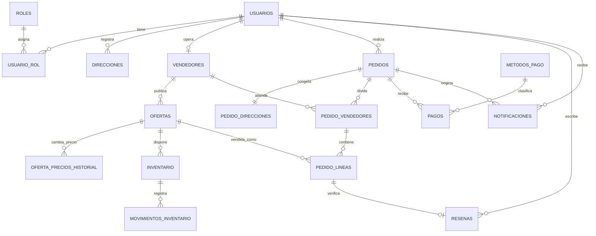

# Modelo objetivo: producto documental y oferta transaccional

**Estado:** Implementado y verificado en las Fases 2–6B
**Alcance:** Entrega 1 y base para las entregas posteriores

## 1. Decisión principal

TiendaYa separa dos conceptos que inicialmente estaban mezclados en la tabla
SQL transicional `productos`:

- **Producto documental:** describe qué es el artículo. Su autoridad es MongoDB.
- **Oferta comercial:** describe quién lo vende, a qué precio y bajo qué condiciones. Su autoridad es MySQL.

MongoDB no es autoridad del precio, vendedor ni inventario. El catálogo
público lee los documentos MongoDB y, en una consulta SQL por lote, enriquece
la página con las ofertas vigentes de MySQL.

## 2. Propiedad de los datos

| Dato | Autoridad | Motivo |
|---|---|---|
| Nombre, descripción y atributos variables | MongoDB `productos` | Estructura heterogénea por categoría |
| Imágenes y metadatos | MongoDB `productos.imagenes` | Se leen junto al producto y tienen volumen acotado |
| Categoría visible | MongoDB, como snapshot embebido | Evita joins para representar el documento |
| Identidad y jerarquía de categorías | MySQL `categorias` | Estructura estable y administrable con integridad |
| Vendedor, SKU comercial y estado de venta | MySQL `ofertas` | Relación comercial y transaccional |
| Precio actual | MySQL `ofertas` | Debe ser consistente con el checkout |
| Historial de precios | MySQL `oferta_precios_historial` | Auditoría temporal exacta |
| Inventario y reservas | MySQL `inventario` | Bloqueos y transacciones ACID |
| Reseñas completas | MySQL `resenas` | Relación con usuario y compra verificada |
| Promedio y total de reseñas | MongoDB `productos.resumen_resenas` | Proyección de lectura para el catálogo |
| Historial documental | MongoDB `producto_eventos` | Replay del estado del producto en una fecha |
| Precio cobrado | MySQL `pedido_lineas.precio_unitario` | Snapshot contractual e inmutable |

## 3. Modelo relacional implementado

### `ofertas`

Representa una publicación vendible de un producto documental.

| Columna | Tipo implementado | Restricción |
|---|---|---|
| `id` | INT UNSIGNED | PK |
| `producto_ref` | CHAR(24) | NOT NULL, referencia lógica a MongoDB |
| `vendedor_id` | INT UNSIGNED | FK `vendedores(id)` |
| `sku` | VARCHAR(50) | NOT NULL |
| `precio_actual` | DECIMAL(12,2) | NOT NULL, CHECK >= 0 |
| `moneda` | CHAR(3) | NOT NULL, DEFAULT `GTQ` |
| `estado` | ENUM | `borrador`, `activa`, `pausada`, `descontinuada` |
| `version` | INT UNSIGNED | Control de concurrencia optimista |
| `fecha_creacion` | DATETIME | UTC |
| `fecha_actualizacion` | DATETIME | UTC |

Restricciones propuestas:

- `UNIQUE(vendedor_id, sku)`.
- `UNIQUE(vendedor_id, producto_ref)` mientras un vendedor solo pueda tener una oferta por producto.
- Nunca eliminar físicamente una oferta usada en pedidos; se descontinúa.

### `oferta_precios_historial`

Conserva los intervalos de vigencia del precio, no una caché diaria.

| Columna | Tipo implementado | Restricción |
|---|---|---|
| `id` | BIGINT UNSIGNED | PK |
| `oferta_id` | INT UNSIGNED | FK `ofertas(id)` |
| `precio` | DECIMAL(12,2) | NOT NULL |
| `moneda` | CHAR(3) | NOT NULL |
| `vigente_desde` | DATETIME(6) | NOT NULL |
| `vigente_hasta` | DATETIME(6) | NULL significa precio vigente |
| `cambiado_por` | INT UNSIGNED | FK `usuarios(id)` |
| `motivo` | VARCHAR(200) | NULL |
| `fecha_registro` | DATETIME(6) | NOT NULL |

La transacción que cambia el precio debe cerrar el intervalo actual, insertar el nuevo intervalo y actualizar `ofertas.precio_actual`.

### `inventario`

El inventario deja de referenciar al producto descriptivo y pasa a referenciar la oferta:

```text
inventario
- id PK
- oferta_id FK -> ofertas.id
- bodega
- cantidad_disponible
- cantidad_reservada
- punto_reorden
- fecha_actualizacion
- UNIQUE(oferta_id, bodega)
```

### `movimientos_inventario`

Cada movimiento debe identificar la fila de inventario afectada:

```text
movimientos_inventario
- id PK
- inventario_id FK -> inventario.id
- tipo
- cantidad
- motivo
- pedido_linea_id FK -> pedido_lineas.id NULL
- usuario_id FK -> usuarios.id NULL
- fecha
```

### `pedido_vendedores`

Separa el cumplimiento de un pedido por vendedor:

```text
pedido_vendedores
- id PK
- pedido_id FK -> pedidos.id
- vendedor_id FK -> vendedores.id
- estado
- subtotal
- costo_envio
- fecha_creacion
- fecha_actualizacion
- UNIQUE(pedido_id, vendedor_id)
```

Un vendedor solo podrá modificar su registro de `pedido_vendedores`. El estado general de `pedidos` se derivará de los estados de sus partes.

### `pedido_lineas`

La línea conserva referencias operativas y snapshots históricos:

```text
pedido_lineas
- id PK
- pedido_id FK -> pedidos.id
- pedido_vendedor_id FK -> pedido_vendedores.id
- oferta_id FK -> ofertas.id
- producto_ref CHAR(24)
- sku_snapshot
- producto_nombre
- vendedor_nombre_snapshot
- precio_unitario
- cantidad
- subtotal_linea
```

`producto_nombre`, `vendedor_nombre_snapshot` y `precio_unitario` representan lo acordado al comprar; no se vuelven a consultar para reconstruir una factura histórica.

### `pedido_direcciones`

Congela la dirección utilizada sin depender de ediciones posteriores del perfil:

```text
pedido_direcciones
- pedido_id PK/FK -> pedidos.id
- receptor_nombre
- receptor_telefono
- pais
- departamento
- municipio
- linea1
- linea2
- codigo_postal
```

### `resenas`

Las reseñas completas permanecen en MySQL:

```text
resenas
- id PK
- usuario_id FK -> usuarios.id
- producto_referencia_id FK -> producto_referencias.id
- pedido_linea_id FK -> pedido_lineas.id NULL
- calificacion
- comentario
- estado_moderacion
- fecha_creacion
```

`producto_referencias.producto_ref` enlaza lógicamente con MongoDB sin duplicar
el documento. `pedido_linea_id` permite distinguir una compra verificada.
MongoDB solo mantiene `resumen_resenas { promedio, total }` como proyección.

### `outbox_eventos`

No es el historial de negocio; es la bandeja confiable para comunicar cambios confirmados en MySQL a MongoDB.

```text
outbox_eventos
- id CHAR(36) PK
- tipo_evento
- agregado_tipo
- agregado_id
- producto_ref CHAR(24) NULL
- payload JSON
- estado ENUM('pendiente','procesando','procesado','error')
- intentos
- ultimo_error
- creado_en
- procesado_en NULL
```

El cambio de precio o disponibilidad y la inserción en outbox ocurren dentro de la misma transacción MySQL. Un worker idempotente publica después el evento en MongoDB.

### `notificaciones`

Está incluida en el DDL versionado con:

- FK `usuario_id -> usuarios(id)` con `ON DELETE CASCADE`.
- FK `pedido_id -> pedidos(id)` con `ON DELETE SET NULL`.
- Índice `(usuario_id, leida, fecha_creacion)`.

## 4. Modelo documental implementado

Ejemplo simplificado de `productos`:

```json
{
  "_id": "ObjectId",
  "nombre": "Laptop Dell Inspiron 15",
  "descripcion": "...",
  "categoria": {
    "id": 2,
    "slug": "computadoras",
    "nombre": "Computadoras"
  },
  "atributos": {
    "procesador": "Intel Core i5-1235U",
    "ram_gb": 16
  },
  "imagenes": [
    { "url": "/static/products/archivo.png", "orden": 0, "es_principal": true }
  ],
  "resumen_resenas": { "promedio": 4.6, "total": 42 },
  "estado_documental": "publicado",
  "fecha_creacion": "UTC",
  "fecha_actualizacion": "UTC"
}
```

El documento activo también puede contener `precio`, stock y vendedor como
proyecciones actualizadas por el outbox. Esos campos no son autoridad: las
ofertas y el inventario de MySQL prevalecen en catálogo y checkout.

## 5. Lectura del catálogo

Para una página del catálogo:

1. MongoDB filtra productos por categoría, texto y atributos documentales.
2. FastAPI reúne sus ObjectId.
3. MySQL ejecuta una sola consulta `WHERE producto_ref IN (...)` para obtener ofertas activas, precio e inventario.
4. FastAPI combina ambos resultados.
5. El frontend recibe `precio_desde` y la oferta destacada, o todas las ofertas en el detalle.

El precio mostrado se toma de la oferta MySQL seleccionada; no se utiliza un
snapshot diario como autoridad del precio actual.

## 6. Escritura y consistencia

### Cambio de precio

En una sola transacción MySQL:

1. Bloquear la oferta.
2. Cerrar el precio histórico vigente.
3. Insertar el nuevo intervalo.
4. Actualizar `ofertas.precio_actual`.
5. Insertar `OFERTA_PRECIO_CAMBIADO` en `outbox_eventos`.

El worker registra posteriormente `PRECIO_ACTUALIZADO` en `producto_eventos`. El precio actual del catálogo sigue leyéndose de MySQL, por lo que un retraso del worker no muestra un precio viejo.

### Checkout

En una sola transacción MySQL:

1. Bloquear ofertas e inventarios con `SELECT ... FOR UPDATE`.
2. Validar estado, precio y cantidades.
3. Crear pedido, partes por vendedor, dirección snapshot y líneas.
4. Descontar inventario y registrar movimientos.
5. Registrar pago.
6. Insertar eventos de disponibilidad en outbox cuando el stock cruce entre disponible y agotado.

## 7. Índices documentales de la Entrega 1

La implementación conserva las proyecciones `precio` y `disponible` y crea el
índice compuesto del catálogo:

```javascript
db.productos.createIndex(
  { "categoria.slug": 1, disponible: 1, precio: -1 },
  { name: "idx_catalogo_categoria_disponible_precio" }
)
```

Los eventos nacidos del outbox tienen unicidad por identificador de mensaje:

```javascript
db.producto_eventos.createIndex(
  { outbox_id: 1 },
  { unique: true, sparse: true, name: "uidx_evento_outbox" }
)
```

La reconstrucción temporal mantiene un índice adicional `(producto_id, timestamp)`.

## 8. Diagrama ER objetivo



MongoDB se relaciona lógicamente mediante `producto_ref`; no existe ni se simula una FK entre motores.

## 9. Invariantes que deben verificarse

- Todo `producto_ref` de una oferta activa corresponde a un documento MongoDB existente.
- El precio mostrado procede de `ofertas.precio_actual`.
- El precio cobrado coincide con el snapshot de `pedido_lineas` creado dentro del checkout.
- Una oferta tiene como máximo un intervalo de precio con `vigente_hasta IS NULL`.
- El stock nunca queda negativo.
- Cada movimiento de venta referencia la línea que lo originó.
- Cada evento de producto tiene una versión única y creciente.
- Un vendedor solo cambia el estado de su propia parte del pedido.
- Las órdenes históricas no dependen de nombres, precios ni direcciones editables.
